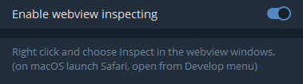

# OKXracer simple Clicker Script in Telegram Desktop

This script automates clicking in a game environment, managing fuel levels and applying strategies for button selection.

## Features

- Automatically clicks buttons at random intervals
- Manages fuel levels and initiates refueling when necessary
- Implements a strategy for selecting between "MOON" and "DOOM" buttons
- Handles AutoPilot functionality
- Includes a refueling timer with randomization

## Configuration

The script uses several constants that can be adjusted:

- `MAX_FUEL`: Maximum fuel capacity (default: 28)
- `BASE_TIME`: Base time for fuel regeneration in milliseconds (default: 150000, i.e., 2.5 minutes)
- `CHECK_INTERVAL`: Interval for checking fuel status in milliseconds (default: 60000, i.e., 1 minute)
- `RELOAD`: Boolean to enable/disable the refuel function (default: false)
- `percentOnDoom`: Probability of choosing the DOOM button (default: 0.2, i.e., 20%)

## Functions

- `clickButtonWithRandomInterval()`: Main function that manages the clicking process
- `checkAndClickAutoPilotButton()`: Checks for and clicks the AutoPilot button if available
- `getFuelIndicator()`: Retrieves the current fuel level
- `clickButton(button, label)`: Clicks a specified button and logs the action
- `refuel()`: Performs the refueling process
- `startRefuelTimer()`: Initiates a timer for refueling with randomization

## Usage

To use this script:

1. Open the game in your Telegram Desktop
2. Open the developer console
3. Copy and paste the script into the console (if insert does not work, write the command `allow pasting`)
4. Press Enter to start the script

The script will run automatically, managing fuel levels and clicking buttons according to the defined strategy.

## Caution

This script automates game actions. Use it responsibly and in accordance with the game's terms of service to avoid any potential issues with your account.

## Activating Developer Console in Telegram Desktop

To run this script using Telegram Desktop:

Open Telegram Desktop
Go to Settings > Advanced > Experimental settings
Find and enable the "Enable webview inspecting" option

On macOS: Right-click and choose "Inspect" in the webview windows, or open from the Develop menu in Safari
On Windows/Linux: Use the keyboard shortcut Ctrl + Shift + I or F12

Restart Telegram Desktop to apply the changes
Open the chat or section where you want to run the script
Open the developer console using the method appropriate for your OS (step 3)
Click on the "Console" tab in the developer tools window
Copy and paste the script into the console
Press Enter to run the script